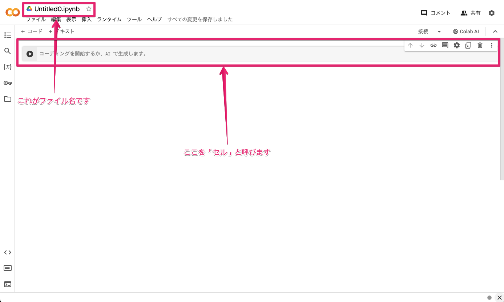
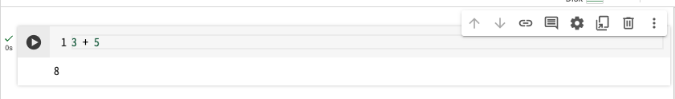

# コンピュータリテラシ発展 〜Pythonを学ぶ〜

## 第 2 回：Pythonを始めよう

情報学部 情報学科 情報メディア専攻
清水 哲也 ( shimizu@info.shonan-it.ac.jp )

---

# 今回の授業内容

---

# 今回の授業内容

- Pythonの特徴
- [Google Colaboratory](https://colab.research.google.com/?hl=ja) の使い方
- Pythonのきほん
- ある条件で処理を分ける
- オブジェクトの扱い
- 課題

---

# Pythonの特徴

---

# Pythonの特徴

Pythonは世界的に人気のあるプログラミング言語であり，その特徴を以下の通りです．

1. **シンプルで読みやすい構文**：Pythonはコードが読みやすく設計されています．
2. **汎用性**：Pythonはウェブ開発，データ分析，AI，機械学習，自動化など，幅広い用途で使用できます．
3. **豊富なライブラリ**：Pythonには標準ライブラリが含まれており，さらに多くのタスクを簡単に行うためのサードパーティライブラリがあります．
4. **インタプリタ型言語**：Pythonはインタプリタ型の言語でコードを一行ずつ実行します．これにより，開発中にコードの変更をすぐにテストできます．

---

# Google Colaboratory の使い方

---

# Google Colaboratory の使い方

- Pythonの開発環境として[Google Colaboratory](https://colab.research.google.com/?hl=ja)を使います
- Google Colabはクラウドに用意された[Jupyter Notebook](https://jupyter.org/)環境でブラウザさえあれば無料で利用可能です
- 大学のGoogleアカウント（@sit.shonan-it.ac.jp）でログインしておけば使用したファイルはGoogle Drive上に保存されます

---

# ノートブックの作成


---

# ノートブックの作成



---

# Colabをつかってみる

プログラムを書いて実行してみる

1. セルに「`3 + 5`」と入力します
2. セルの左側にある「三角ボタン」をクリックします（初回は少し時間がかかります）
3. 計算結果が表示されればOK



---

# Google Colabの使い方

基本的には以下の繰り返しです

- 「セル」にプログラムを入力する
- 「三角ボタン」を押す
- 結果を得る

---

# Pythonのきほん

---

# データの性質

- 扱うデータの種類のよってデータ型が異なります
- 例：「a」や「Hello」などは文字列
- 例：「1」や「-20」などは整数
- データの性質ごとに分類されています

### 整数を表示する場合

```
print(1)
```

### 文字列を表示する場合

```
print('hello world') or print("hello world")
```

---

# データの性質

| データ型 |    概要    |            例            |
| -------- | ---------- | ------------------------ |
| `str`    | 文字列     | `'abc'`, `"hello world"` |
| `int`    | 整数       | `1`, `-500`              |
| `float`  | 浮動小数点 | `1.23`                   |
| `bool`   | 真偽値     | `True` もしくは `False`  |
| `list`   | リスト     | `[1, 2, 3]`              |
| `tuple`  | タプル     | `(1,2,3)`, `1,2,3`       |
| `dict`   | 辞書       | `{'a':1, 'b':2}`         |

---

# オブジェクトと関数

### オブジェクト
- オブジェクトは「データ型」や「値」といった要素で構成されます
- 「データ型」はデータを性質に応じて分類したものです
- 「値」はデータそのもののことです
- 例：`'hello'`というオブジェクトは，データ型がstr型で，値がhelloとなります
- 参考：https://docs.python.org/ja/3/reference/datamodel.html

### 関数
- 入力値を与えると何らかの処理を実行し出力値を返すものです
- 例：`print()` 関数

---

# Pythonでの計算
参考：算術演算子（教科書:表2-2）（Colabの場合`print()`がなくてもOK）

### `+` ：加算（足し算）
足し算を行うときには演算子「`+`」を利用します．
```
print(10 + 30)
```

### `-` ：減算（引き算）
引き算を行うときには演算子「`-`」を利用します．
```
print(10 - 30)
```

---

# Pythonでの計算

### `*` ：乗算（掛け算）
掛け算を行うときには演算子「`*`」を利用します．「×」ではないので注意してください．
```
print(10 * 30)
```

### `**` ：べき乗
べき乗（$n$乗，$a^n$）の計算を行うときには演算子「`**`」を利用します．
```
print(10 ** 3)
```

---

# Pythonでの計算

### `/` ：除算（割り算）
割り算を行うときには演算子「`/`」を利用します．「÷」ではないので注意してください．
```
print(10 / 3)
```

### `//` ：除算（小数点以下切り捨て）
小数点以下を切り捨てた割り算を行うときには演算子「`//`」を利用します．割り算の整数の商を求めます．
```
print(10 // 3)
```

---

# Pythonでの計算

### `%` ：剰余（除算した余り）
割り算の余りを求める場合は演算子「`%`」を利用します．
```
print(10 % 3)
```

### `divmod`関数 ：除算&剰余
Pythonには割り算を行ったときの小数点以下を切り捨てた答え（割り算の整数の商）とその余りを同時に求める関数が用意されています．
```
print(divmod(10, 3))
```