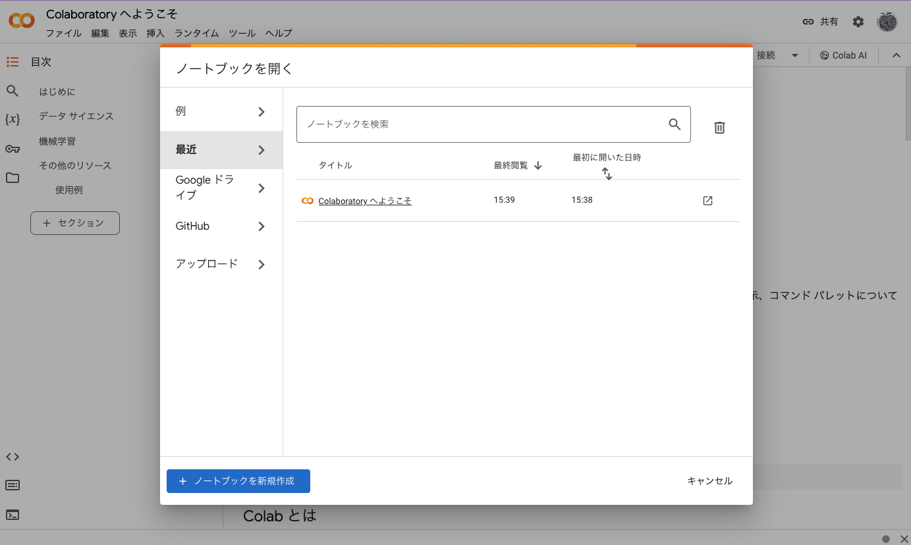

# コンピュータリテラシ発展 〜Pythonを学ぶ〜

## 第 2 回：Pythonを始めよう

情報学部 情報学科 情報メディア専攻
清水 哲也 ( shimizu@info.shonan-it.ac.jp )

---

# 今回の授業内容

---

# 今回の授業内容

- Pythonの特徴
- [Google Colaboratory](https://colab.research.google.com/?hl=ja) の使い方
- Pythonのきほん
- ある条件で処理を分ける
- オブジェクトの扱い
- 課題

---

# Pythonの特徴

---

# Pythonの特徴

Pythonは世界的に人気のあるプログラミング言語であり，その特徴を以下の通りです．

1. **シンプルで読みやすい構文**：Pythonはコードが読みやすく設計されています．
2. **汎用性**：Pythonはウェブ開発，データ分析，AI，機械学習，自動化など，幅広い用途で使用できます．
3. **豊富なライブラリ**：Pythonには標準ライブラリが含まれており，さらに多くのタスクを簡単に行うためのサードパーティライブラリがあります．
4. **インタプリタ型言語**：Pythonはインタプリタ型の言語でコードを一行ずつ実行します．これにより，開発中にコードの変更をすぐにテストできます．

---

# Google Colaboratory の使い方

---

# Google Colaboratory の使い方

- Pythonの開発環境として[Google Colaboratory](https://colab.research.google.com/?hl=ja)を使います
- Google Colabはクラウドに用意された[Jupyter Notebook](https://jupyter.org/)環境でブラウザさえあれば無料で利用可能です
- 大学のGoogleアカウント（@sit.shonan-it.ac.jp）でログインしておけば使用したファイルはGoogle Drive上に保存されます

---

# ノートブックの作成

---

# ノートブックの作成

