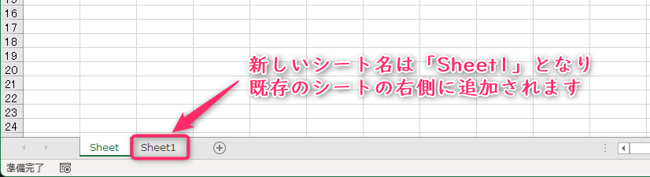
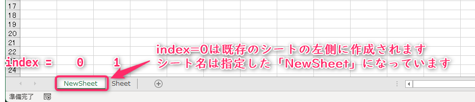
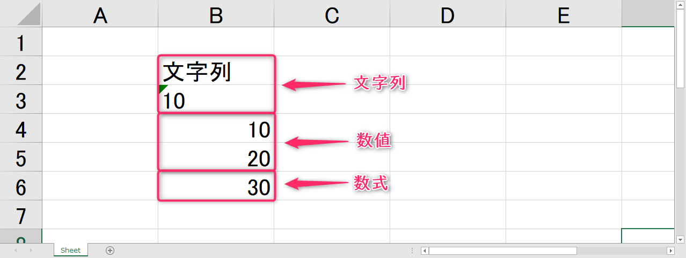
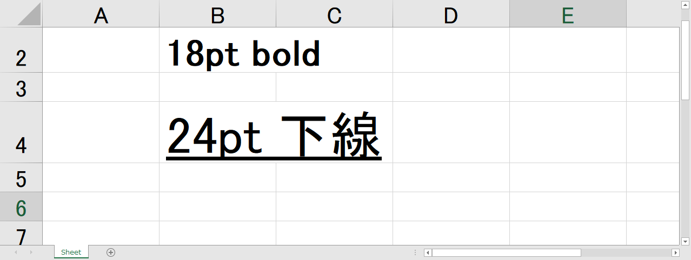

# コンピュータリテラシ発展 〜Pythonを学ぶ〜

## 第6回：Excel作業を自動化しよう(2)

情報学部 情報学科 情報メディア専攻
清水 哲也 ( shimizu@info.shonan-it.ac.jp )

---

# 今回の授業内容

---

# 今回の授業内容

- 前回の課題解説
- Excelファイルを編集する
- Excelのレイアウトを編集する
- 課題

---

# 前回の課題解説

---

# 前回の課題解説

- 前回の課題の解答例を示します
- 解答例について質問があればご連絡ください

## 解答例

https://colab.research.google.com/drive/1uG8eKYq9ryLH-ght91ojIO4XK-z96mbJ?usp=sharing

---

# Excelファイルを編集する

---

# Excelファイルを新規作成する

- Excelファイル（ワークブック）を新規作成します

```python
import openpyxl as op

wb = op.Workbook()
wb.save('filename.xlsx')
```

- `workbook`の引数を空にすると新しいワークブックを読み込みます
- `save()`メソッドで保存します
- 保存作為を指定したい場合はパスを含めて指定する必要があります

---

# Excelファイルを新規作成する

- Excelファイル（ワークブック）を新規作成します（パスを含む場合）

```python
import openpyxl as op

wb = op.Workbook()
wb.save('/content/drive/MyDrive/???/filename.xlsx')
```

- `workbook`の引数を空にすると新しいワークブックを読み込みます
- `save()`メソッドで保存します
- 保存作為を指定したい場合はパスを含めて指定する必要があります

---

# 新規作成したExcelファイルの確認


---

# Excelシートを追加/削除します

- 新しいシートを追加します

```py
Workbookオブジェクト.create_sheet()
```

- 挿入位置とシート名を指定してシートを追加します

```py
Workbookオブジェクト.create_sheet(index = 数字, title = 'シート名')
```

- Excelシートを削除します

```py
Workbookオブジェクト.remove(Worksheetオブジェクト)
```

---

# Excelシートを追加/削除します

- 新しいシートを追加します

```py
wb = op.Workbook()

wb.create_sheet()
print(wb.sheetnames)
wb.save('/content/drive/MyDrive/???/create_sheet.xlsx')
```



---

# Excelシートを追加/削除します

- 挿入位置とシート名を指定して新しいシートを追加します

```py
wb = op.Workbook()

wb.create_sheet(index = 0, title = 'NewSheet')
print(wb.sheetnames)
wb.save('/content/drive/MyDrive/???/create_sheet.xlsx')
```



---

# Excelシートを追加/削除します

- シートを追加して既存のシートを削除します

```py
wb = op.Workbook()

wb.create_sheet()
print(wb.sheetnames)

wb.remove(wb[‘Sheet’])
print(wb.sheetnames)
```
---

# セルの値を編集します

- 指定したセルを編集します
  - 文字列を入力します　：　`Worksheetオブジェクト[セル] = '文字列'`
  - 数値を入力します　：　`Worksheetオブジェクト[セル] = 数値`
  - 数式を入力します　：　`Worksheetオブジェクト[セル] = '=数式'`

---

# セルの値を編集します（結果）



---

# フォントを設定します

- `Font()`関数：セルのフォント設定をする関数です
- `Font()`関数を使用するには`op.styles.fonts.Font`と書く必要があります
- 書くのが大変なので関数を指定してインポートしておきます

```py
import openpyxl as op
from openpyxl.styles.fonts import Font
```

- `Font`関数の基本的な使い方です

```py
Font(キーワード引数1=値, キーワード引数2=値・・・)
```

詳細：https://openpyxl.readthedocs.io/en/stable/styles.html

---

# フォントを設定します

- `Font`関数の基本的な使い方です

```py
Font(キーワード引数1=値, キーワード引数2=値・・・)
```

- 例：フォントサイズを18pt, 太文字にする設定です

```py
Font(size=18, bold=True)
```

- 例：フォントサイズを24pt, 斜体にする設定です

```py
Font(size=24, italic=True)
```

---

# `Font()`関数の代表的な引数

|  引数名  | データ型 |                            解説                            |
| -------- | -------- | ---------------------------------------------------------- |
| `name`   | 文字列型 | フォント名を指定します（例：`name='メイリオ'`）            |
| `size`   | 整数型   | フォントsizeを変更します（例：`size=18`）                  |
| `bold`   | ブール型 | `True`で太文字になります（例：`bold=True`）                |
| `italic` | ブール型 | `True`でイタリック(斜体)になります（例：`italic=True`）    |
| `color`  | 文字列型 | カラーコードで文字の色を指定します（例：`color='FF0000'`） |
| `strike` | ブール型 | `True`で打ち消し線が引けます（例：`strike=True`）          |

---

# フォントを設定します

```py
wb = op.Workbook()
sheet = wb.active

sheet['B2'] = '18pt bold'
sheet['B2'].font = Font(size=18, bold=True)

sheet['B4'] = '24pt 下線'
sheet['B4'].font = Font(size=24, underline='single')

wb.save('/content/drive/MyDrive/???/font.xlsx')
```

---

# フォントを設定します（結果）



---

# 課題

---

# 課題

- Moodleにある「SCfCL-6th-prac.ipynb」ファイルをダウンロードしてColabにアップロードしてください
- 課題が完了したら「File」>「Download」>「Download .ipynb」で「.ipynb」形式でダウンロードしてください
- ダウンロードした **.ipynbファイル** をMoodleに提出してください
- 提出期限は **5月30日(木) 20時まで** です
