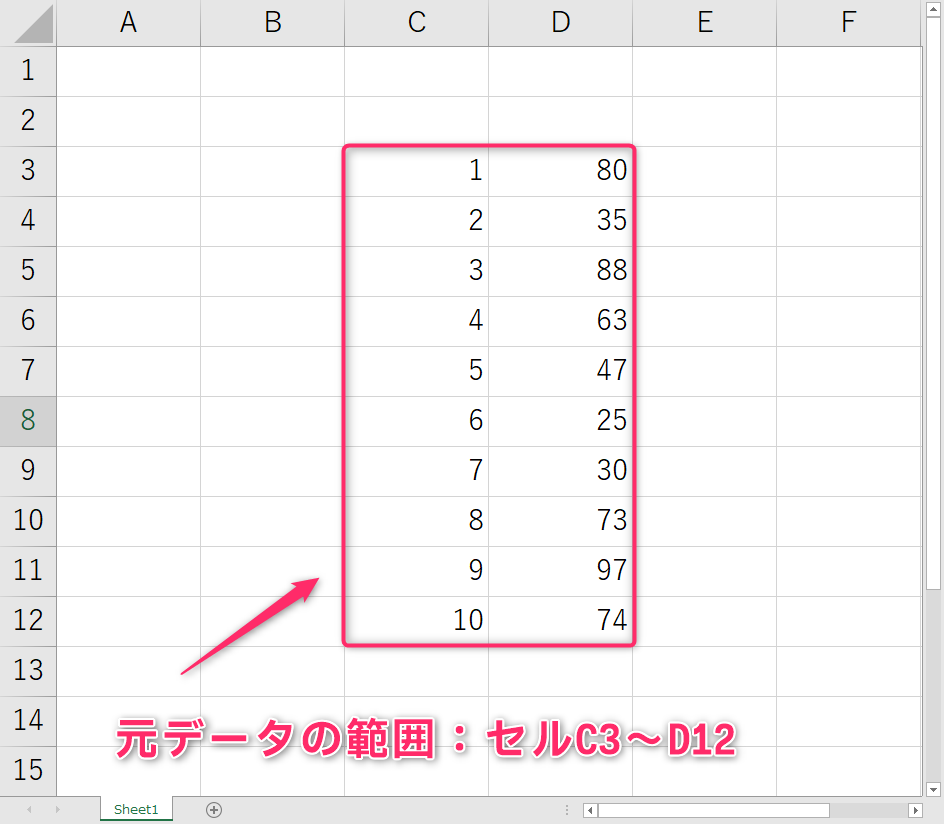

<!-- スライドURL：https://docs.google.com/presentation/d/1Hd3drkThhEUcVxniYPPcNgURlhmZKMsJPqyBQUiNiog/edit?usp=sharing --->

# コンピュータリテラシ発展 〜Pythonを学ぶ〜

## 第7回：Excel作業を自動化しよう(3)

情報学部 情報学科 情報メディア専攻
清水 哲也 ( shimizu@info.shonan-it.ac.jp )

---

# 今回の授業内容

---

# 今回の授業内容

- 前回の課題解説
- Excelのグラフを作成する
- 課題

---

# 前回の課題解説

---

# 前回の課題解説

- 前回の課題の解答例を示します
- 解答例について質問があればご連絡ください

## 解答例

https://colab.research.google.com/drive/1W6opl8qaSnRefT5zX9pGUZoX2DPnAJTh?usp=sharing

---

# Excelのグラフを作成する

---

# Excelのグラフを作成する

- ここで学ぶことを以下にまとめます
  - グラフが読み込むデータを決める
  - グラフの種類を決める
  - グラフにデータをわたす
  - グラフをつくる
  - データから系列をつくる

---

# グラフが読み込むデータを決める

- グラフを作成するために元となるデータが必要です
- 元データのセルを範囲選択するための関数
  - `Reference()`関数

```py
Reference(Workbookオブジェクト,
          min_col = データ取得を始めるcolumn位置,
          min_row = データ取得を始めるrow位置,
          max_col = データ取得を終えるcolumn位置,
          max_row = データ取得を終えるrow位置)
```

---

# データ読み込み例

 
```py
Reference(Worksheetオブジェクト,
          min_col = 3, # 元データの開始列（左上）番号
          min_row = 3, # 元データの開始行（左上）番号
          max_col = 4, # 元データの終了列（右下）番号
          max_row = 12 # 元データの終了行（右下）番号
          )
```


---

# グラフの種類を消める

- 代表的なグラフの種類
  - [BarChart（棒グラフ）](https://openpyxl.readthedocs.io/en/latest/charts/bar.html)
  - [PieChart（円グラフ）](https://openpyxl.readthedocs.io/en/latest/charts/pie.html)
  - [LineChart（折れ線グラフ）](https://openpyxl.readthedocs.io/en/latest/charts/line.html)
  - [ScatterChart（散布図）](https://openpyxl.readthedocs.io/en/latest/charts/scatter.html)
  - [それ以外](https://openpyxl.readthedocs.io/en/latest/charts/introduction.html)

---

# グラフの種類を決める

- グラフの種類を決めたら`Chart`オブジェクトを作成します
- 例：**BarChart（棒グラフ）** を作成します
  ```py
  chart = BarChart()
  ```
- グラフタイトル，グラフの横幅，高さをしていします
  ```py
  chart.title = 'タイトル名'
  chart.width = 横幅の値
  chart.height = 高さの値
  ```

- グラフの種類によって異なる属性をもちます
- 棒グラフの場合，横軸と縦軸のタイトル属性があります
  ```py
  barchart.x_axis.title = '横軸タイトル'
  barchart.y_axis.title = '縦軸タイトル'
  ```
---

# グラフにデータをわたす

- Chartオブジェクトがもつ `add_data()` メソッドを使います
- Chartオブジェクトにグラフ作成に必要なデータをわたすことができます

```py
Chartオブジェクト.add_data(Referenceオブジェクト)
```

---

# グラフをつくる

- 元のデータの指定，グラフ種類の決定，データをわたすところまでできたのでグラフを作成します
- Worksheetオブジェクトの`add_chart()`メソッドでシートにグラフを追加できます

```py
Worksheetオブジェクト.add_chart(Chartオブジェクト, 'グラフを追加するセル位置')
```

---

# グラフを作る

```py
import openpyxl as op
from openpyxl.chart import BarChart, Reference

wb = op.load_workbook(‘/content/drive/MyDrive/????/sample_chart.xlsx’)
ws = wb[‘Sheet’]

ref_obj = Reference(ws, min_col=1, min_row=1, max_col=1, max_row=10)

chart = BarChart()
chart.title = 'sample chart'
chart.add_data(ref_obj)

ws.add_chart(chart, 'C1')
wb.save(‘/content/drive/MyDrive/????/sample_chart.xlsx’)
```

---

# グラフを作る（結果）

（生成したグラフのスクショを貼り付ける）

---

# データから系列をつくる

- **系列**：同じ系列のデータをまとめたもののことです
- 先ほど作成したグラフで「**系列1**」と書いてある部分です
- 系列を設定するとそのデータが具体的に何なのかがわかります
- 系列は`Series`オブジェクトとして表します
- `Series`オブジェクトは`Reference`オブジェクトをわたして生成します
- `Series`オブジェクトは`Chart`オブジェクトの`append()`メソッドにわたします

---

# データから系列を作る

```py
import openpyxl as op
from openpyxl.chart import BarChart, Reference, Series

wb = op.load_workbook(‘/content/drive/MyDrive/????/sample_chart.xlsx’)
ws = wb[‘Sheet’]

ref_obj = Reference(ws, min_col=1, min_row=1, max_col=1, max_row=10)
series_obj = Series(ref_obj, title = ‘sample series’)

chart = BarChart()
chart.title = 'sample chart'
chart.append(series_obj)

ws.add_chart(chart, 'C1')
wb.save(‘/content/drive/MyDrive/????/sample_chart.xlsx’)
```

---

# データから系列を作る（結果）

（画像を貼り付ける）

---

# 課題

---

# 課題

- Moodleにある「SCfCL-6th-prac.ipynb」ファイルをダウンロードしてColabにアップロードしてください
- 課題が完了したら「File」>「Download」>「Download .ipynb」で「.ipynb」形式でダウンロードしてください
- ダウンロードした **.ipynbファイル** と作成した **Excelファイル3つ** をMoodleに提出してください
- 提出期限は **5月30日(木) 20時まで** です
