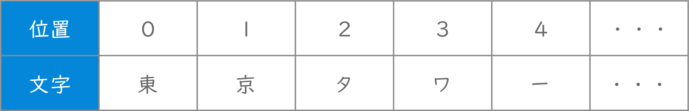

<!-- スライドURL：https://docs.google.com/presentation/d/1en3iGS3B-GlsSBFECzfODm5qjF3iIN72v04S5zuJzcw/edit?usp=sharing --->

# コンピュータリテラシ発展 〜Pythonを学ぶ〜

## 第9回：Excel作業の前工程・後工程の自動化

情報学部 情報学科 情報メディア専攻
清水 哲也 ( shimizu@info.shonan-it.ac.jp )

---

# 今回の授業内容

---

# 今回の授業内容

- 前回の課題解説
- 文字列操作
- CSVデータの処理
- 課題

---

# 前回の課題解説

---

# 前回の課題解説

- 前回の課題の解答例を示します
- 解答例について質問があればご連絡ください

## 解答例

（後でURLを貼り付ける）

---

# 文字列操作

---

# 文字列操作

- Pythonで文字列の操作を行います
  - 文章から特定の情報の抽出や加工が簡単にできるようになります
  - **正規表現**を利用してより発展的な文字列検索などを可能にします
- 正規表現について詳しくかつわかりやすく説明しているサイト
  - https://www.tohoho-web.com/ex/regexp.html


---

# 文字列操作

- 文字列操作の前に対象となるテキストファイルとそれを置いておくフォルダを作成します
- Google Driveの授業用フォルダに「**text_search**」というフォルダを作成
- 「**text_search**」フォルダに「**file.txt**」ファイルを作成
- ファイル内容は以下の通りです

```shell
東京タワーの郵便番号は105-0011で、東京スカイツリーの郵便番号は131-0045です。
```

---

# 文字列操作

- 文字列操作の前に対象となるテキストファイルとそれを置いておくフォルダを作成します

```py
import os
# 作業場所に「text_search」フォルダを作成する
os.makedirs('/content/drive/MyDrive/???/text_search', exist_ok=True)

# 「text_search」フォルダに「file.txt」ファイルを作成して文章を入力する
with open('/content/drive/MyDrive/???/text_search/file.txt', 'x') as f:
  f.write('東京タワーの郵便番号は105-0011で、東京スカイツリーの郵便番号は131-0045です。')
```

---

# 文字列操作

- 文字列がふくまれるかどうかを判定
- **in演算子**
  - 任意の文字列が含まれるかどうかを判定
  - 含まれる場合：**True**
  - 含まれない場合：**False**

---

# 文字列操作

- 文字列が含まれている位置を判定
- **`find()`メソッド**
  - 任意の文字列が含まれる開始位置を返す
  - 開始位置は「**0**」から数え始める



---

# 文字列操作

- 文字列検索を使って「タワー」という文字列の有無と開始位置を検索
- 文字列がふくまれるかどうかを判定 ： **in演算子**
- 文字列の開始位置を判定 ： **`find()`メソッド**

```py
with open('/content/drive/MyDrive/???/text_search/file.txt', encoding='UTF-8') as f:
  text = f.read()

if 'タワー' in text:
  fd = text.find('タワー')
  print('タワーという文字列が' + str(fd + 1) + '字目に含まれています')
else:
  print('タワーという文字列は含まれていません')
```

---

# 正規表現を使って文字列を検索

- 正規表現とは
  - 文字列のパターンを表現する記述方法
  - 参考サイト
    - https://w.wiki/5SGg
    - https://docs.python.org/ja/3/library/re.html
    - https://www.tohoho-web.com/ex/regexp.html


---

# 正規表現を使って文字列を検索

- 正規表現とは
  - 「**^**(キャレット)」「**.**(ピリオド)」「**\***(アスタリスク)」「**\d**」などの特別な意味を持ったメタ文字と通常の文字（リテラル）の組み合わせで表現します
  - メタ文字はたくさんの種類があります

---

| 表現 |                         意味                          |
| ---- | ----------------------------------------------------- |
| .    | 改行を除くすべての文字のいずれか1文字                 |
| *    | 直前の文字を0回以上繰り返し（0回=その文字がない場合） |
| {N}  | 直前のパターンのN回の連続                             |
| ^    | 行頭の位置                                            |
| $    | 行末の位置                                            |
| A\|B | AかBのいずれか1文字                                   |

---

| 表現  |                               意味                               |
| ----- | ---------------------------------------------------------------- |
| [X]   | []内に指定した文字のいずれか1文字                                |
| [X-Y] | []内「-」の左右に指定した文字の，文字コード範囲内のいずれか1文字 |
| [^X]  | []内に指定した文字X以外のいずれか1文字                           |
| \d    | 数字１文字，[0-9]と同義                                          |
| \D    | 数字以外の文字列の１文字                                         |
| \w    | すべてのアルファベットとアンダースコアのいずれか１文字           |

---

# 課題

---

# 課題

- Moodleにある「SCfCL-8th-prac.ipynb」ファイルをダウンロードしてColabにアップロードしてください
- 課題が完了したら「File」>「Download」>「Download .ipynb」で「.ipynb」形式でダウンロードしてください
- ダウンロードした **.ipynbファイル** をMoodleに提出してください
- 提出期限は **6月13日(木) 20時まで** です
